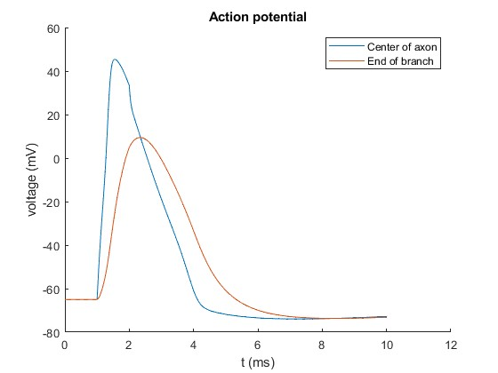

# NEURON Toolbox

Interface for connecting NEURON and MATLAB (on Windows, for MATLAB R2022a+).

This exploration branch is intended to explore the possibilities for 
connecting the two tools at a low level (C/C++) and avoid any third-party 
dependencies (e.g. work here will not require Python).

MATLAB is a registered trademark of The MathWorks, Inc. 

## Usage

### Setup

First, make sure NEURON for Windows is installed (see http://neuron.yale.edu/).

To get the toolbox working on your machine, run the MATLAB scripts in the following order:
- **setup_nrn_paths** 
    - to add the appropriate directories to your path (you might need to
      change the NEURON installation directory)
- **setup_build_interface**
    - to generate the library definition file
    - to automatically adapt & uncomment in the library definition file:
        - the function get_vector_vec: `<SHAPE>` is "len"
        - the Section attribute pt3d: `<MLTYPE>` is "clib.array.neuron.Pt3d", `<SHAPE>` is "npt3d"
    - to build the library interface

### Example scripts

A comprehensive example live script can be found at **examples/example_livescript.mlx**.

Smaller example scripts are available at:
- **examples/example_run** 
    - to initialize a Neuron session and call some top-level functions from the library
- **examples/example_vector** 
    - to create a Vector object and calculate some properties
- **examples/example_morph** 
    - to generate a morphology by connecting different Sections
- **examples/example_acpot** 
    - to generate an action potential

**example_acpot** should result in:



## Code structure

### The Neuron class

The main Neuron class can be found at `neuron.Neuron`. We can
initialize a Neuron session by instantiating it:

```matlab
n = neuron.Neuron();
```

Now all top-level variables, functions and classes can be accessed
using this object. The available variables, functions and classes, as 
well as their Neuron types can be displayed with:

```matlab
n.list_functions();
```

Top-level variables, functions and objects can be called directly. E.g.:

```matlab
disp(n.t);                  % Display the time
n.fadvance();               % Advance by one timestep
v = n.Vector();             % Create a Vector object
```

These variables, functions and objects are created dynamically. This works 
by making the Neuron class a subclass of `dynamicprops`, allowing us to
pass the name of whichever variable, function or object the user is calling to 
`clib.neuron.hoc_lookup` as a string. `clib.neuron.hoc_lookup` returns a 
`clib.neuron.Symbol` pointing to the correct variable, function or object. 
Depending on the Neuron type, this `clib.neuron.Symbol` can be passed to:

```matlab
clib.neuron.ref             % variables, type 263
clib.neuron.hoc_call_func   % functions, type 280
clib.neuron.hoc_newobj1     % objects, type 325
```

Moreover, a Neuron function can expect some number of arguments,
which it will take from the Neuron stack machine. These arguments
need to be placed on the stack before calling the function, using
`neuron.push_hoc`. Output can be read by popping items off the stack
with `neuron.pop_hoc`. If the user provides
the incorrect number or types of input arguments, or tries to pop
output off the stack if there is none, the code might crash.

### Neuron Objects

A Neuron `clib.neuron.Object` is wrapped by MATLAB in the class 
`neuron.Object`. It has variables and methods, which are also 
generated dynamically using a `dynamicprops` subclassing construction.
Object variables and methods can be displayed using `list_methods`:

```matlab
v = n.Vector();
v.list_methods();
```

Watch out: if the user provides
the incorrect number or types of input arguments, the code might crash! We
hope to fix this behavior in NEURON 9, in which error handling will be updated.

The C++ object can be accessed with:

```matlab
Cpp_obj = v.get_obj();
```

Keep in mind that not all C++ object attributes are recognized by
MATLAB: it cannot understand unions, for example.

### Sections

The `neuron.Section` class is the most straightforward MATLAB class in 
terms of implementation. Its methods and attributes are not generated 
dynamically.

```matlab
main = n.Section("main");       % Make main Section
branch = n.Section("branch");   % Make branch
branch.connect(0, main, 1);     % Connect start of branch to end of main
n.topology();                   % Display resulting topology
```

For calls to some top-level variables, functions or objects, it is
necessary to put a Section on the stack first. For example,
before attaching an IClamp to a Section, we need to first push the 
Section onto the stack with `clib.neuron.nrn_pushsec`. 
After creating the IClamp, we must not forget to run 
`clib.neuron.nrn_sec_pop` to take the Section off the stack again.
The `neuron.Neuron` class takes care of this automatically
(see `neuron.Neuron.hoc_new_obj`) if the user provides a Section
as input.

### NrnRef

The class `clib.neuron.NrnRef` contains a pointer to a Neuron variable, 
and was added to make sure MATLAB handles pointers correctly. 
The NrnRef can be given to `neuron.hoc_push` to put the pointer
on the Neuron stack.

The variable itself can be set or read with:

```matlab
t = n.ref("t");     % n.ref returns an NrnRef to a top-level variable
t.set(3.14);        % Sets the variable; equivalent to n.t = 3.14;
disp(t.get());      % Display the variable
```

## Notes

### Static library file

We use clibgen with MinGW64, and give it a .a static library file, 
which is included in bin/.

Hence this version only works on Windows (for now) for MATLAB versions 
R2022a and up; at this version support for .a static libraries was added. 

To convert the libnrniv.dll file to a static library we used the following
steps:
- We can see the libnrniv.dll contents with `dumpbin /exports bin/libnrniv.dll`
- All the exports listed there were saved to bin/libnrniv.def
- The DLL can then be converted to a .a file with `dlltool -d bin/libnrniv.def -D bin/libnrniv.dll -l bin/libnrniv.a`
- dlltool.exe can be found (for me) at C:\ProgramData\MATLAB\SupportPackages\R2022a\3P.instrset\mingw_w64.instrset\bin\dlltool.exe

### Useful links

- [Creating a definition file](https://nl.mathworks.com/help/matlab/ref/clibgen.generatelibrarydefinition.html)
- [MATLAB/C++ data type mapping](https://nl.mathworks.com/help/matlab/matlab_external/matlab-to-c-data-type-mapping.html)
- [Lifetime management](https://nl.mathworks.com/help/matlab/matlab_external/memory-management-for-c-objects-in-matlab.html)
- [Releasing C++ memory](https://nl.mathworks.com/help/matlab/ref/clibrelease.html?s_tid=doc_ta)
- [Dynamic methods with subsref](https://nl.mathworks.com/matlabcentral/answers/59026-is-it-possible-to-dynamically-add-methods-to-an-object-or-to-build-a-generic-method-that-catches-a)
- [dynamicprops](https://nl.mathworks.com/help/matlab/ref/dynamicprops-class.html)